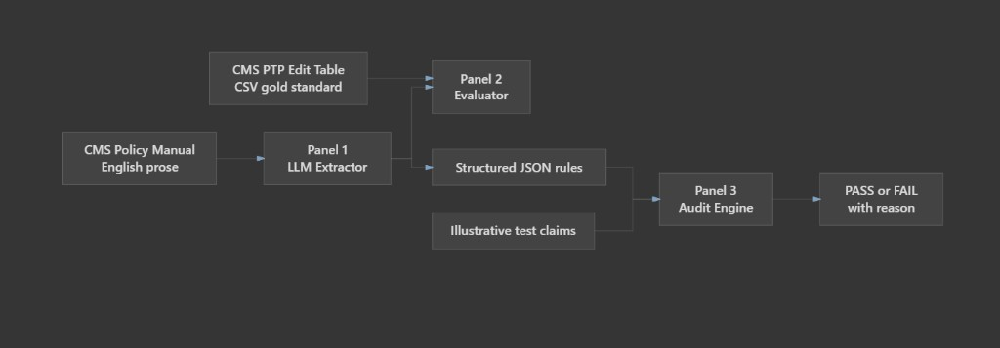

# PolicyEngine POC — Content Management in Health Care

[](https://www.python.org/)
[](https://streamlit.io/)
[]()

**Author:** Shreyash  
**Organization:** Cotiviti GenAI Intern Screening Exercise

A proof-of-concept that converts real CMS NCCI policy prose into structured claim-edit rules using an LLM, evaluates those rules against the published Procedure-to-Procedure (PTP) edit table, and applies them deterministically to illustrative test claims — so language understanding and claim decisions stay strictly separated.

---

## Architecture


The POC enforces a two-layer design: the **LLM proposes** structured rules from narrative policy text; **deterministic Python decides** pass/fail on each claim with auditable reason strings. An evaluator scores extraction quality against public CMS ground truth.

| Layer | Module | Role |
|-------|--------|------|
| **Layer 1 — Extractor** | `src/extractor.py` | Reads CMS policy narrative and outputs structured JSON rules (`column1_code`, `column2_code`, `modifier_allowed`, `rationale_quote`). Language understanding only. |
| **Evaluator** | `src/evaluator.py` | Scores extracted code pairs vs. the real NCCI edit table (precision, recall, F1) and flags hallucinated `rationale_quote` values not found verbatim in the source text. |
| **Layer 2 — Auditor** | `src/audit_engine.py` | Pure deterministic claim checks — code match, date of service, anatomical location, modifier bypass. **No LLM calls.** |
| **Demo UI** | `src/app.py` | Single-page Streamlit app: policy in → JSON + metrics → live audit on test claims. |

---

## Overview

Medicare and commercial payers maintain large libraries of written coding policy. Translating that prose into executable edit logic is slow, error-prone, and hard to audit when an LLM is allowed to make final claim decisions.

**PolicyEngine** demonstrates a safer pattern:

1. **Extract** — An open-source LLM (via Groq) reads a real CMS NCCI policy excerpt and proposes machine-readable bundling rules for CPT **28230** (tenotomy) and **64450** (digital block).
2. **Evaluate** — Extracted pairs are compared to the matching row in the public NCCI Practitioner PTP edit file; rationale quotes are checked for verbatim grounding in the source text.
3. **Audit** — A deterministic engine applies the extracted rules to hand-built test claims. Outcomes are reproducible and explainable without any model inference at decision time.

This separation directly addresses the primary concern about LLMs in claims systems: the model may interpret policy, but **code** — not the model — adjudicates each claim.

---

## Features

- **Real CMS inputs** — Policy excerpt and gold PTP edit row for the 28230 / 64450 pair (no synthetic policy text).
- **Groq-powered extraction** — `llama-3.3-70b-versatile` with JSON-structured rule output and supporting quotes.
- **Simulation mode** — Runs offline without an API key using a rule set grounded in the policy excerpt.
- **Gold-table evaluation** — Precision, recall, and F1 on extracted `(Column1, Column2)` pairs vs. `data/ncci_edit_table_subset.csv`.
- **Hallucination detection** — Flags `rationale_quote` strings that do not appear verbatim in the source policy.
- **Deterministic audit engine** — Code match, same date of service, anatomical location, and NCCI modifier bypass (59, XE, XS, XP, XU).
- **Single-page Streamlit demo** — Three panels: input policy → extracted JSON + scores → live pass/fail audit.
- **CLI entry points** — Run extractor, evaluator, or audit engine standalone from the command line.

---

## Tech stack

| Component | Technology |
|-----------|------------|
| Language | Python 3.10+ |
| Demo UI | [Streamlit](https://streamlit.io/) |
| LLM API | [Groq](https://console.groq.com/) — `llama-3.3-70b-versatile` |
| Data / metrics | [pandas](https://pandas.pydata.org/) |
| Configuration | [python-dotenv](https://pypi.org/project/python-dotenv/) |
| Ground truth | CMS NCCI Policy Manual + Practitioner PTP edit files |

---

## Project structure

```
Shreyash_Intern_Cotiviti_Submission/
├── README.md
├── requirements.txt
├── .env.example                  # GROQ_API_KEY placeholder only
├── .gitignore
├── data/
│   ├── ncci_policy_excerpt.txt   # CMS policy narrative (28230 / 64450)
│   └── ncci_edit_table_subset.csv # Gold PTP edit row
├── docs/
│   ├── architecture-flow.png
│   ├── Shreyash_Intern_Cotiviti_Report.docx
│   ├── Shreyash PolicyEngine POC Presentation.pptx
│   ├── VIDEO_SCRIPT_FINAL.md
│   └── DEMO_VIDEO_SCRIPT.md
└── src/
    ├── extractor.py              # Layer 1: LLM extraction
    ├── evaluator.py              # Precision / recall / F1 + hallucination check
    ├── audit_engine.py           # Layer 2: deterministic claim audit
    └── app.py                    # Streamlit demo
```

---

## Quick start

**Requirements:** Python 3.10 or newer.

```bash
git clone <your-repo-url>
cd Shreyash_Intern_Cotiviti_Submission

python -m venv .venv

# Windows
.venv\Scripts\activate

# macOS / Linux
source .venv/bin/activate

pip install -r requirements.txt
```

**Environment (optional for live LLM extraction):**

```bash
copy .env.example .env    # Windows
# cp .env.example .env    # macOS / Linux
```

Edit `.env` and set `GROQ_API_KEY=your-groq-api-key-here`. Obtain a free key at [console.groq.com](https://console.groq.com/).

Without an API key, the app runs in **simulation mode** using a rule set grounded in the policy excerpt — useful for offline demo and recording.

**Run the Streamlit demo:**

```bash
streamlit run src/app.py
```

**Optional CLI modules (from repo root):**

```bash
python src/extractor.py
python src/evaluator.py
python src/audit_engine.py
```

---

## How it works

### Panel 1 — Input policy text

Displays the editable CMS NCCI policy excerpt from `data/ncci_policy_excerpt.txt`. Click **Extract rules** to invoke the Groq API (or simulation fallback). The extractor returns a JSON array of bundling rules with CPT codes, modifier allowance, and a supporting `rationale_quote` from the narrative.

### Panel 2 — Extracted JSON + evaluation score

Shows the structured rules and evaluation metrics against the gold PTP table:

- **Precision / Recall / F1** — Set overlap between predicted `(column1_code, column2_code)` pairs and the gold CSV row (`28230` / `64450`).
- **Hallucination flags** — Any `rationale_quote` not found verbatim in the source policy text is surfaced for review.

### Panel 3 — Live audit results

Runs the deterministic audit engine on two hand-constructed illustrative claims:

| Example | Expected outcome | Why |
|---------|------------------|-----|
| **PASS** | Pass | Same DOS and location, but Column 2 line carries Modifier **59** (distinct procedural service). |
| **FAIL** | Fail | Same DOS and location, no qualifying NCCI modifier — Column 2 is bundled into Column 1. |

See `src/audit_engine.py` for the full claim schema and audit logic.

---

## Data sources

All files in `data/` are real CMS source material. Do not modify them.

| File | Description |
|------|-------------|
| `data/ncci_policy_excerpt.txt` | Narrative excerpt from the CMS NCCI Policy Manual, Chapter I, Section C (Medical/Surgical Package), using CPT **28230** / **64450** as the bundling example. |
| `data/ncci_edit_table_subset.csv` | Matching gold-standard row from the public NCCI Practitioner PTP edit files: `28230` / `64450`, `Modifier_Indicator=1`. |

**CMS references:**

| Resource | Link |
|----------|------|
| Medicare NCCI Policy Manual | [cms.gov — NCCI Policy Manual](https://www.cms.gov/medicare/coding-billing/national-correct-coding-initiative-ncci-edits/medicare-ncci-policy-manual) |
| NCCI for Medicare (overview) | [cms.gov — NCCI Edits](https://www.cms.gov/medicare/coding-billing/national-correct-coding-initiative-ncci-edits) |
| Practitioner PTP Edits (quarterly ZIP) | [cms.gov — Medicare NCCI PTP Edits](https://www.cms.gov/medicare/coding-billing/national-correct-coding-initiative-ncci-edits/medicare-ncci-procedure-procedure-ptp-edits) |

---

## Evaluation

The evaluator (`src/evaluator.py`) treats extraction as a **code-pair retrieval** task:

| Metric | Definition |
|--------|------------|
| **Precision** | Fraction of predicted pairs that appear in the gold PTP table |
| **Recall** | Fraction of gold pairs recovered by the extractor |
| **F1** | Harmonic mean of precision and recall |
| **Hallucination check** | Each `rationale_quote` must appear verbatim in the input policy text |

Run standalone evaluation:

```bash
python src/evaluator.py
```

With simulation mode and the bundled policy excerpt, the gold pair `28230` / `64450` is expected to score highly when extraction is grounded in the source material.

---

## Demo claims disclaimer

Panel 3 uses **illustrative test claims only**. They were constructed by hand to exercise the deterministic audit logic. They are **not** real claims data, member records, or production adjudication inputs. **No dollar amounts, recovery figures, or financial projections** are shown or implied.

---

## Deliverables

| Deliverable | Location |
|-------------|----------|
| Written report (Word, bibliography) | `docs/Shreyash_Intern_Cotiviti_Report.docx` |
| PowerPoint presentation (7 slides) | `docs/Shreyash PolicyEngine POC Presentation.pptx` |
| Demo video script (4–5 min) | `docs/VIDEO_SCRIPT_FINAL.md` |
| POC source code | `src/`, `data/`, `requirements.txt` |
| Architecture diagram | `docs/architecture-flow.png` |

---

## Submission

When ready to submit to Cotiviti:

1. Push this repository to GitHub and grant reviewer access.
2. Record the demo video per `docs/VIDEO_SCRIPT_FINAL.md` and add the `.mp4` to `docs/` if required.
3. Send email:

| Field | Value |
|-------|-------|
| **To** | jesus.hurtado@cotiviti.com |
| **Subject** | `INTERN - Shreyash - [Your University Name]` |
| **Body** | Links to the GitHub repository, written report, slides, and demo video |

Replace `[Your University Name]` with your actual university before sending.

---

## License & disclaimer

This repository is an **intern screening proof-of-concept** submitted to Cotiviti. It is provided for evaluation and demonstration purposes only.

- **Not production software** — No warranty, SLA, or fitness for live claims processing.
- **Not medical or coding advice** — Illustrative rules and test claims do not replace certified coding guidance or payer policy.
- **API keys** — Never commit real credentials. Use `.env` locally (see `.env.example`).

---

*Topic 3 — Conversion of Written Policy into Rules (CMS NCCI bundling example)*
